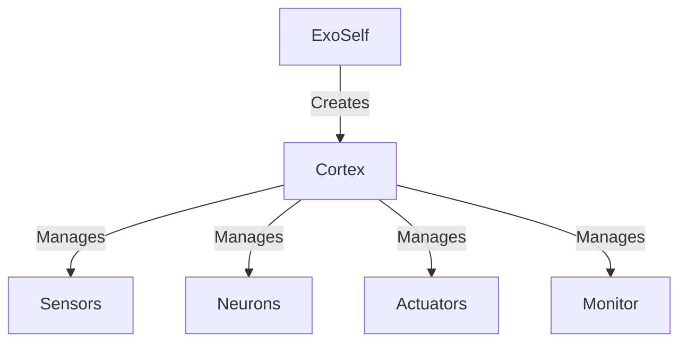
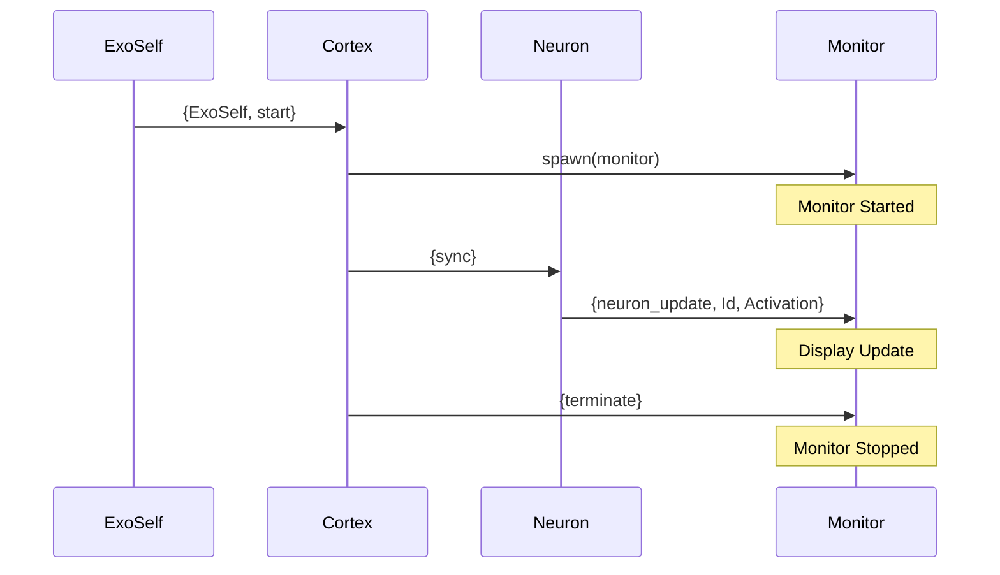

# Feed-Forward Neural Network in Erlang/OTP

## Overview

This project implements a Feed-Forward Neural Network (FFNN) using Erlang/OTP's actor model. Each component of the neural network (neurons, sensors, actuators, and cortex) is implemented as a separate process, allowing for concurrent execution and message passing.

## Architecture

### System Components

The system consists of several key modules:

1. `exoself.erl` - Orchestrates the network creation and lifecycle
2. `constructor.erl` - Generates the network structure
3. `sensor.erl` - Handles input generation
4. `neuron.erl` - Implements neuron behavior
5. `actuator.erl` - Manages output processing
6. `cortex.erl` - Orchestrates the network operation
7. `records.hrl` - Defines data structures

### Process Hierarchy



### Message Flow



### Key Components

```erlang
-record(sensor, {id, cortex_id, name, vector_length, fanout_ids}).
-record(actuator, {id, cortex_id, name, vector_length, fanin_ids}).
-record(neuron, {id, cortex_id, activation_function, input_ids, output_ids}).
-record(cortex, {id, sensor_ids, actuator_ids, neuron_ids}).
```

## Neural Network Mathematics

### Dot Product

The dot product is used in neurons to compute the weighted sum of inputs:

```erlang
dot([I | Input], [W | Weights], Acc) ->
    dot(Input, Weights, I * W + Acc);
dot([], [], Acc) ->
    Acc.
```

This operation:

- Multiplies each input by its corresponding weight
- Sums all products
- Determines neuron activation strength

### Activation Function (tanh)

The network uses hyperbolic tangent (tanh) as its activation function:

```erlang
tanh(Val) ->
    math:tanh(Val).
```

Key properties:

- Bounds output between -1 and 1
- Non-linear transformation
- Smooth gradient
- Zero-centered output

Benefits for neural networks:

1. Prevents numerical overflow
2. Allows for negative outputs
3. Strong gradients near zero
4. Smooth activation curves

## System Components

### ExoSelf

The ExoSelf is responsible for:

1. Reading network configuration (genotype)
2. Spawning all neural processes
3. Establishing connections
4. Managing network lifecycle
5. Saving updated weights

### Cortex

Orchestrates:

- Network synchronization
- Information flow
- Process termination
- Weight updates

### Neurons

Handle:

- Input processing
- Weight application
- Activation function
- Output distribution

## Setup

1. Ensure Erlang/OTP 26 or later is installed
2. Compile all modules:

```erlang
c(exoself).
c(constructor).
c(sensor).
c(neuron).
c(actuator).
c(cortex).
```

## Usage

### Creating a Network

```erlang
constructor:construct_genotype("ffnn.erl", rng, pts, [1,3]).
```

Parameters:

- `"ffnn.erl"` - Output file name
- `rng` - Sensor type (random number generator)
- `pts` - Actuator type (prints to screen)
- `[1,3]` - Hidden layer configuration (1 neuron in first hidden layer, 3 in second)

### Running the Network

```erlang
exoself:map("ffnn.erl").
```

## Network Flow

1. **Initialization**:
   - ExoSelf reads genotype
   - Spawns all processes
   - Establishes connections

2. **Operation**:
   - Sensor generates input
   - Neurons process data
   - Actuator presents output
   - Cortex synchronizes steps

3. **Learning**:
   - Weights are updated
   - Network state is saved
   - Genotype is modified

## Implementation Details

### Concurrency Model

- Each neural component is a separate Erlang process
- Communication via message passing
- Supervised by Cortex process
- Coordinated by ExoSelf

### Data Persistence

- Network configuration stored in files
- Weight updates saved automatically
- Restartable from saved state

### Error Handling

- Process monitoring
- Graceful termination
- State preservation

## Resources

For learning more about Erlang/OTP and neural networks:

- [Learn You Some Erlang](https://learnyousomeerlang.com/) - Excellent Erlang tutorial
- [Erlang Documentation](https://www.erlang.org/docs) - Official documentation
- [Making reliable distributed systems in the presence of software errors](https://erlang.org/download/armstrong_thesis_2003.pdf) - Joe Armstrong's thesis on Erlang

## Example Session

```erlang
Eshell V14.1.1
1> c(constructor).
{ok,constructor}
2> constructor:construct_genotype("ffnn.erl",rng,pts,[1,3]).
ok
3> exoself:map("ffnn.erl").
<0.123.0>
```

This will:

1. Generate a neural network configuration
2. Save it to `ffnn.erl`
3. Create and start a network with:
   - Random number generator input
   - Two hidden layers (1 and 3 neurons)
   - Print-to-screen output

## Implementation Notes

- Uses Erlang's actor model for concurrent processing
- Each neuron runs as a separate process
- Communication happens via message passing
- Uses hyperbolic tangent (tanh) as activation function
- Supports dynamic network topology
- Persistent state through file storage
- Coordinated by ExoSelf process

Let me know if you need any clarification or have questions about specific parts of the implementation!
