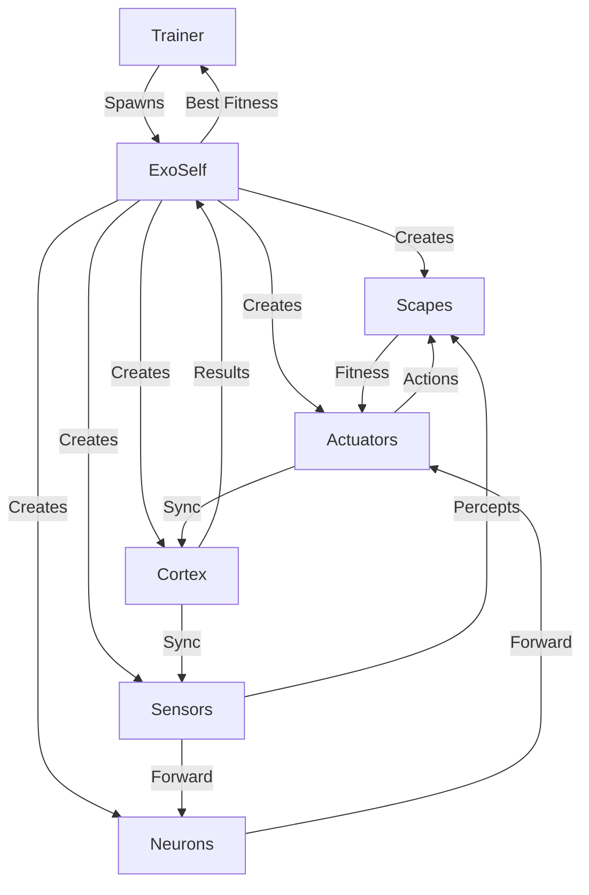
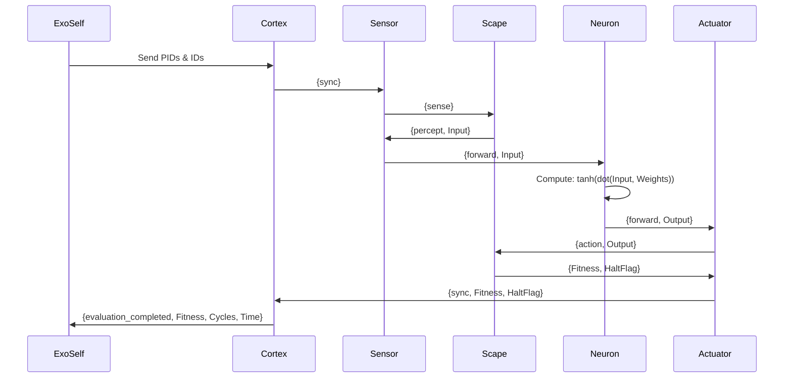

# Feed-Forward Neural Network in Erlang/OTP

## Overview

This project implements a Feed-Forward Neural Network (FFNN) using Erlang/OTP's actor model with a perturbation-based learning algorithm. Each component of the neural network (neurons, sensors, actuators, cortex, and scapes) is implemented as a separate concurrent process, allowing for parallel execution and message-passing based communication.

## Architecture

### System Components

The system consists of several key modules:

1. `exoself.erl` - Orchestrates the network creation, lifecycle, and training loop
2. `genotype.erl` - Generates and persists network structure and weights
3. `morphology.erl` - Defines problem-specific sensor/actuator configurations
4. `scape.erl` - Implements environment simulations (e.g., XOR problem)
5. `sensor.erl` - Handles input generation from scapes
6. `neuron.erl` - Implements neuron behavior with weight management
7. `actuator.erl` - Manages output processing and fitness collection
8. `cortex.erl` - Orchestrates synchronous network operation cycles
9. `trainer.erl` - Manages training sessions with fitness tracking
10. `benchmarker.erl` - Runs statistical benchmarks across multiple training runs
11. `platform.erl` - Gen_server for managing shared scapes and modules
12. `records.hrl` - Defines data structures

### Process Hierarchy



### Message Flow (One Evaluation Cycle)



### Key Data Structures

#### Core Neural Network Records

```erlang
-record(sensor, {id, cortex_id, name, scape, vector_length, fanout_ids}).
-record(actuator, {id, cortex_id, name, scape, vector_length, fanin_ids}).
-record(neuron, {id, cortex_id, activation_function, input_ids, output_ids}).
-record(cortex, {id, sensor_ids, actuator_ids, neuron_ids}).
```

**Note:** Sensors and actuators include a `scape` field which specifies the environment (e.g., `{private, xor_sim}` for a private XOR simulator).

#### Evolutionary Algorithm Records (Future Support)

```erlang
-record(agent, {id, generation, population_id, specie_id, cortex_id, fingerprint,
                constraint, evolution_history=[], fitness, innovation_factor=0, pattern=[]}).
-record(specie, {id, population_id, fingerprint, constraint, agent_ids=[], dead_pool=[],
                 champion_ids=[], fitness, innovation_factor=0}).
-record(population, {id, platform_id, specie_ids=[], morphologies=[], innovation_factor}).
-record(constraint, {morphology=xor_mimic, neural_afs=[tanh, cos, gauss, abs]}).
```

These records support evolutionary/genetic algorithm capabilities:
- **agent**: Individual neural network in a population with evolutionary history
- **specie**: Group of similar agents sharing a fingerprint
- **population**: Collection of species being evolved
- **constraint**: Evolutionary constraints (morphology type, available activation functions)

## Neural Network Mathematics

### Dot Product

The dot product is used in neurons to compute the weighted sum of inputs:

```erlang
dot([I | Input], [W | Weights], Acc) ->
    dot(Input, Weights, I * W + Acc);
dot([], [], Acc) ->
    Acc.
```

This operation:

- Multiplies each input by its corresponding weight
- Sums all products
- Determines neuron activation strength

### Activation Function (tanh)

The network uses hyperbolic tangent (tanh) as its activation function:

```erlang
tanh(Val) ->
    math:tanh(Val).
```

Key properties:

- Bounds output between -1 and 1
- Non-linear transformation
- Smooth gradient
- Zero-centered output

Benefits for neural networks:

1. Prevents numerical overflow
2. Allows for negative outputs
3. Strong gradients near zero
4. Smooth activation curves

## Detailed Component Descriptions

### ExoSelf (exoself.erl)

The ExoSelf process is the top-level orchestrator responsible for:

1. **Genotype Loading**: Reads network configuration from ETS table files
2. **Process Spawning**: Creates all cerebral units (cortex, sensors, neurons, actuators) and scapes
3. **Connection Mapping**: Establishes IdsNPIds ETS table mapping element IDs to PIDs
4. **Process Linking**: Sends initialization messages with connection information
5. **Training Loop**: Implements perturbation-based learning:
   - Perturbs random subset of neuron weights (probability = 1/sqrt(total_neurons))
   - Backs up weights when fitness improves
   - Restores weights when fitness degrades
   - Terminates after MAX_ATTEMPTS (50) consecutive failures
6. **Genotype Persistence**: Saves trained weights back to genotype file
7. **Result Reporting**: Communicates final fitness/statistics to trainer process

### Cortex (cortex.erl)

The Cortex orchestrates the synchronous operation of the neural network:

- **Cycle Management**: Triggers sensors to begin each evaluation cycle
- **Synchronization**: Collects sync messages from all actuators before starting next cycle
- **Fitness Accumulation**: Aggregates fitness scores from actuators
- **Evaluation Completion**: Detects end of evaluation (via EndFlag) and reports to ExoSelf
- **State Transitions**: Switches between active (running) and inactive (waiting for reactivation) states
- **Timing**: Tracks cycle count and execution time for performance metrics

### Scapes (scape.erl)

Scapes implement the problem environments:

- **XOR Simulator** (`xor_sim/1`): Provides XOR training data
  - Cycles through 4 XOR cases: `[{[-1,-1],[-1]}, {[1,-1],[1]}, {[-1,1],[1]}, {[1,1],[-1]}]`
  - Calculates Mean Squared Error (MSE) between network output and target
  - Returns fitness as `1/(MSE + 0.00001)` after completing all 4 cases
- **Protocol**: Responds to `{sense}` messages with percepts, receives `{action, Output}` messages
- **Scope**: Can be private (spawned per network) or public (shared across networks)

### Sensors (sensor.erl)

Sensors generate or retrieve input data:

- **Scape Communication**: Sends `{sense}` message and receives `{percept, Vector}` response
- **Data Forwarding**: Broadcasts sensory vector to all connected neurons (fanout)
- **Sensor Types**:
  - `xor_GetInput/2`: Retrieves input from XOR scape
  - `rng/1`: Generates random numbers (for testing)
- **Synchronization**: Triggered by cortex `{sync}` messages

### Neurons (neuron.erl)

Neurons perform the core neural computation:

- **Weighted Sum**: Computes dot product of inputs and weights
- **Activation**: Applies tanh activation function
- **Weight Management**:
  - `weight_backup`: Stores current weights in process dictionary
  - `weight_restore`: Reverts to backed up weights
  - `weight_perturb`: Randomly perturbs weights (probability = 1/sqrt(total_weights))
- **Saturation**: Limits weight values to ±2π range
- **Delta Multiplier**: Uses 2π for perturbation magnitude

### Actuators (actuator.erl)

Actuators collect network outputs and interact with scapes:

- **Output Collection**: Gathers outputs from all connected neurons (fanin)
- **Scape Interaction**: Sends `{action, Output}` to scape, receives `{Fitness, HaltFlag}`
- **Fitness Reporting**: Forwards fitness and halt flag to cortex
- **Actuator Types**:
  - `xor_SendOutput/2`: Sends output to XOR scape and gets fitness
  - `pts/2`: Prints result to screen (for debugging)

### Platform (platform.erl)

The Platform module is a gen_server that manages shared infrastructure:

- **Scape Management**: Hosts public scapes that can be shared across multiple networks
- **Module Supervision**: Starts and stops supervised modules
- **Mnesia Integration**: Initializes and manages Mnesia database for evolutionary algorithms
- **Database Schema**: Creates tables for populations, species, agents, and neural components
- **Utility Functions**:
  - `platform:sync()`: Recompiles all modules using `make:all([load])`
  - `platform:create()`: Creates Mnesia schema and tables
  - `platform:reset()`: Deletes and recreates Mnesia schema
  - `platform:start()`: Starts the platform gen_server
  - `platform:stop()`: Gracefully stops the platform

**Note**: Currently configured with empty module and scape lists. Designed for future evolutionary algorithm support with persistent storage in Mnesia.

## Setup

1. Ensure Erlang/OTP 26 or later is installed
2. Compile all modules:

```erlang
% Compile all modules at once
make:all([load]).

% Or use platform sync
platform:sync().

% Or compile individual modules
c(genotype).
c(morphology).
c(exoself).
c(cortex).
c(sensor).
c(neuron).
c(actuator).
c(scape).
c(trainer).
c(benchmarker).
```

## Usage

### Creating a Network Genotype

```erlang
% Create XOR network with one hidden layer of 2 neurons
genotype:construct(test_nn_genotype, xor_mimic, [2]).

% Create with multiple hidden layers
genotype:construct(my_network, xor_mimic, [3, 2]).
```

Parameters:

- `test_nn_genotype` - Genotype file name (will be saved as ETS table)
- `xor_mimic` - Morphology (defines sensors/actuators for XOR problem)
- `[2]` - Hidden layer configuration (one hidden layer with 2 neurons)

### Running a Network (Single Evaluation)

```erlang
% Map genotype to phenotype and run until completion
PId = exoself:map(test_nn_genotype).
```

This will:
1. Load the genotype from file
2. Spawn all processes (cortex, sensors, neurons, actuators, scapes)
3. Run training for up to 50 attempts
4. Save improved weights back to genotype
5. Print final results

### Training with the Trainer

```erlang
% Basic training (5 attempts, infinite eval limit, infinite fitness target)
trainer:go(xor_mimic, [2]).

% Training with custom parameters
MaxAttempts = 10,
EvalLimit = 1000,
FitnessTarget = 0.9,
trainer:go(xor_mimic, [2], MaxAttempts, EvalLimit, FitnessTarget).
```

The trainer will:
- Create a new genotype for each training run
- Run until MaxAttempts, EvalLimit, or FitnessTarget is reached
- Save the best genotype to a file (e.g., `best_12345`)
- Print the final results

### Running Benchmarks

```erlang
% Run 100 training sessions and collect statistics
benchmarker:go(xor_mimic, [2]).

% Custom number of runs
benchmarker:go(xor_mimic, [2], 50).

% Full control over all parameters
benchmarker:go(xor_mimic, [2], MaxAttempts, EvalLimit, FitnessTarget, TotRuns).
```

Benchmark output includes:
- Fitness: Max, Min, Avg, Std
- Evaluations: Max, Min, Avg, Std
- Cycles: Max, Min, Avg, Std
- Time: Max, Min, Avg, Std

## Network Flow

### 1. Initialization Phase
- ExoSelf loads genotype from ETS file
- Spawns scape processes for environment simulation
- Spawns cortex, sensors, neurons, and actuators
- Creates IdsNPIds mapping table (ID ↔ PID)
- Links all processes by sending initialization messages with connection info

### 2. Evaluation Cycle
- **Cortex** sends `{sync}` to all sensors
- **Sensors** request percepts from scapes, forward to neurons
- **Neurons** compute weighted sum + tanh activation, forward to next layer
- **Actuators** collect outputs, send to scape, receive fitness
- **Actuators** send `{sync, Fitness, HaltFlag}` to cortex
- **Cortex** accumulates fitness, checks for evaluation completion

### 3. Learning Phase (Perturbation-Based)
- **ExoSelf** receives evaluation results from cortex
- If fitness improved:
  - Send `{weight_backup}` to all neurons → saves current weights
  - Reset attempt counter
- If fitness degraded:
  - Send `{weight_restore}` to perturbed neurons → revert to backup
  - Increment attempt counter
- Select random neuron subset (probability = 1/sqrt(N))
- Send `{weight_perturb}` to selected neurons
- Send `{reactivate}` to cortex to start next evaluation

### 4. Termination
- After MAX_ATTEMPTS (50) consecutive failures, training ends
- ExoSelf collects final weights from neurons
- Updates genotype and saves to file
- Sends results to trainer process (if registered)
- All processes receive `{terminate}` messages and shut down

## Implementation Details

### Concurrency Model

- Each component (cortex, sensor, neuron, actuator, scape) runs as a separate Erlang process
- Communication exclusively via asynchronous message passing
- ExoSelf manages the phenotype lifecycle without OTP supervision trees
- Processes use receive loops to handle messages
- IdsNPIds ETS table provides O(1) ID-to-PID and PID-to-ID lookups

### Data Persistence (Genotype/Phenotype Separation)

- **Genotype**: Static network blueprint stored in ETS table files
  - Contains structure (connectivity), initial weights, morphology
  - Created by `genotype:construct/3`
  - Updated with trained weights after successful training
  - Loaded via `genotype:load_from_file/1`
- **Phenotype**: Running network of concurrent processes
  - Spawned from genotype by `exoself:map/1`
  - Lives only during training/evaluation
  - Neurons maintain current weights and backup weights in memory
  - Terminated after training; weights persisted back to genotype

### Process Spawning Pattern

All processes follow a common spawning pattern:
```erlang
gen(ExoSelf_PId, Node) ->
    spawn(Node, ?MODULE, prep, [ExoSelf_PId]).

prep(ExoSelf_PId) ->
    receive
        {ExoSelf_PId, InitData} ->
            loop(InitData)
    end.
```

This allows distributed deployment and clean initialization.

### Weight Perturbation Algorithm

Neurons use a random perturbation strategy:
- Perturbation probability per weight: `MP = 1/sqrt(TotalWeights)`
- Perturbation magnitude: `(rand:uniform() - 0.5) * 2π`
- Weights saturated to range `[-2π, 2π]`
- Same perturbation applied to bias weights

### Morphology System

Morphologies define problem-specific interfaces:
- `morphology:Morphology(sensors)` returns sensor specifications
- `morphology:Morphology(actuators)` returns actuator specifications
- Each sensor/actuator specifies its scape (environment)
- Currently implemented: `xor_mimic` for XOR problem

### Scape Protocol

Scapes must implement:
- `{ScapePId, sense}` → respond with `{ScapePId, percept, Vector}`
- `{ActuatorPId, action, Output}` → respond with `{ScapePId, Fitness, HaltFlag}`
- `{ExoSelfPId, terminate}` → cleanup and terminate

HaltFlag = 1 signals evaluation complete; 0 means continue.

## Resources

For learning more about Erlang/OTP and neural networks:

- [Learn You Some Erlang](https://learnyousomeerlang.com/) - Excellent Erlang tutorial
- [Erlang Documentation](https://www.erlang.org/docs) - Official documentation
- [Making reliable distributed systems in the presence of software errors](https://erlang.org/download/armstrong_thesis_2003.pdf) - Joe Armstrong's thesis on Erlang

## Example Sessions

### Basic Network Creation and Training

```erlang
Eshell V14.1.1

% Compile all modules
1> make:all([load]).

% Create a genotype for XOR problem with 2 hidden neurons
2> genotype:construct(test_nn_genotype, xor_mimic, [2]).
ok

% Print the genotype structure
3> genotype:print(test_nn_genotype).
{cortex,cortex,[{sensor,{-0.5,1.234}}],[{actuator,{-0.5,5.678}}],
       [{neuron,{1,1}},{neuron,{1,2}},{neuron,{2,1}}]}
{sensor,{-0.5,1.234},cortex,xor_GetInput,{private,xor_sim},2,
       [{neuron,{1,1}},{neuron,{1,2}}]}
...

% Train the network
4> exoself:map(test_nn_genotype).
ExoSelf: Starting prep for test_nn_genotype
Cortex: Starting with 1 sensors, 3 neurons, 1 actuators
Actuator {actuator,{-0.5,5.678}}: Got fitness 12.5, endflag 1
Cortex:<0.95.0> finished training. Genotype has been backed up.
 Fitness:156.78
 TotEvaluations:8
 TotCycles:32
 TimeAcc:45678
<0.89.0>
```

### Running a Benchmark

```erlang
% Run 10 training sessions to collect statistics
5> benchmarker:go(xor_mimic, [2], 10).
<0.120.0>

Starting benchmark run 10 of 10
Run complete: Fitness=145.67 Evals=12
...
Benchmark results for: xor_mimic
Fitness::
 Max:245.89
 Min:98.45
 Avg:156.23
 Std:34.56
Evals::
 Max:25
 Min:5
 Avg:12.3
 Std:5.2
...
```

### Using the Trainer

```erlang
% Train with custom limits
6> trainer:go(xor_mimic, [2], 10, 100, 200.0).
<0.130.0>

% Trainer will create unique genotype files like:
% - experimental_123456 (working copy)
% - best_123456 (best solution found)
```

## Key Concepts

### Genotype vs Phenotype
- **Genotype** = Blueprint (ETS table file with structure and weights)
- **Phenotype** = Running network (living processes doing computation)
- Training happens in phenotype, results saved to genotype

### Perturbation-Based Learning
Instead of backpropagation, this system uses evolutionary-style learning:
1. Randomly tweak some weights
2. If performance improves → keep changes
3. If performance degrades → revert changes
4. Repeat until convergence or max attempts

### Message-Passing Architecture
- No shared memory between components
- All communication via Erlang messages
- Natural parallelism and fault isolation
- Supports distributed deployment across nodes

### Morphologies
Define the "body" of the neural network:
- What sensors does it have? (inputs)
- What actuators does it have? (outputs)
- What scape (environment) does it interact with?

## Extending the System

### Adding a New Morphology

1. Define sensors and actuators in `morphology.erl`:
```erlang
my_problem(sensors) ->
    [#sensor{id={sensor,helpers:generate_id()},
             name=my_GetInput,
             scape={private,my_sim},
             vector_length=4}];
my_problem(actuators) ->
    [#actuator{id={actuator,helpers:generate_id()},
               name=my_SendOutput,
               scape={private,my_sim},
               vector_length=2}].
```

2. Implement sensor/actuator functions in their respective modules
3. Implement scape in `scape.erl`:
```erlang
my_sim(ExoSelf_PId) ->
    % Initialize environment
    my_sim(ExoSelf_PId, InitialState).

my_sim(ExoSelf_PId, State) ->
    receive
        {From, sense} ->
            From ! {self(), percept, InputVector},
            my_sim(ExoSelf_PId, State);
        {From, action, Output} ->
            Fitness = evaluate(Output, State),
            HaltFlag = check_done(State),
            From ! {self(), Fitness, HaltFlag},
            my_sim(ExoSelf_PId, update_state(State));
        {ExoSelf_PId, terminate} ->
            ok
    end.
```

