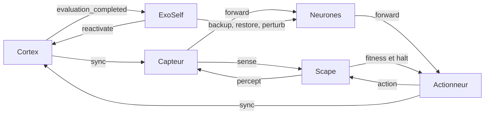

# NN — apprendre la neuroévolution en Erlang

Une base expérimentale pour suivre *Handbook of Neuroevolution Through Erlang*
de Gene I. Sher : comprendre un réseau, ajuster ses poids, observer ses décisions,
puis construire progressivement un système qui fait évoluer sa structure.

Le projet reste en **Erlang** : petites fonctions, clauses, récursion terminale,
compréhensions de listes et passage de messages. Chaque processus porte une
responsabilité limitée ; les protocoles et les transitions d'état relient le tout.

**Pour reprendre dans le train : [atelier hors ligne](docs/TRAIN.md).**
Pour comprendre la simulation : [Petite vie, le fil à suivre](docs/LIFE.md).
Les commentaires `ATELIER` dans les sources indiquent les points à explorer.

## Sommaire

- [Démarrer](#démarrer)
- [Ce qui fonctionne aujourd'hui](#ce-qui-fonctionne-aujourdhui)
- [Entraîner depuis le shell](#entraîner-depuis-le-shell)
- [Comprendre le moteur](#comprendre-le-moteur)
- [Lire et modifier le code](#lire-et-modifier-le-code)
- [Vérifier les résultats](#vérifier-les-résultats)
- [La suite du projet](#la-suite-du-projet)

## Démarrer

Prérequis : **Erlang/OTP 26 ou ultérieur**, **rebar3**, un shell et un navigateur.
La validation actuelle a été exécutée avec OTP 26. Le calcul utilise les modules
Erlang du dépôt ; l'interface est en HTML/CSS/JavaScript, sans compilation Node.js.
Aucun compte, clé API ou variable d'environnement n'est nécessaire.

Ces travaux sont sur la branche `codex/life-simulation` :

```sh
git clone --branch codex/life-simulation https://github.com/Maartz/NN.git
cd NN
rebar3 compile
rebar3 eunit
./scripts/life.sh
```

Ouvrir ensuite `_build/life/index.html` dans un navigateur. Sur macOS :

```sh
open _build/life/index.html
```

La page démarre sur **ExoSelf** et propose quatre comportements : une règle
programmée, le réseau initial, une population simplifiée et le réseau entraîné
par ExoSelf. On peut avancer d'un pas, lire un épisode, changer de monde et
inspecter les perceptions et les quatre scores de direction.

**Le navigateur rejoue des épisodes calculés en Erlang.** Il n'entraîne pas le
réseau en direct. Relancer le script régénère et remplace les résultats.
Pour conserver plusieurs expériences, choisir un autre dossier :

```sh
./scripts/life.sh _build/life-autre/index.html
```

### Travailler hors ligne et partager le replay

Exécuter `rebar3 compile` une fois avec une connexion pour préparer les outils
locaux, notamment le plugin ExDoc. La page générée est autonome : ses données
sont intégrées et elle fonctionne sans serveur ni connexion. On peut partager
ce fichier HTML seul. Il n'y a pas de service applicatif à déployer.

Un serveur local est facultatif, par exemple avec Python 3 :

```sh
python3 -m http.server 8765 --bind 127.0.0.1 --directory _build/life
```

Ouvrir alors [la page locale](http://127.0.0.1:8765/). Pour les expériences au
shell hors ligne, après compilation :

```sh
erl -pa _build/default/lib/nn/ebin
```

## Ce qui fonctionne aujourd'hui

| Élément | État |
|---|---|
| Réseau à processus : capteurs, neurones, actionneurs, cortex | Fonctionnel sur les scénarios testés |
| ExoSelf : perturbation, sauvegarde, restauration et limites d'entraînement | Fonctionnel, avec graines reproductibles |
| XOR | Apprentissage et rechargement vérifiés par les tests |
| Petite vie | Même monde pour les quatre comportements, épisodes ExoSelf enregistrés avec les vrais acteurs |
| Persistance des réseaux autonomes | Fichiers ETS ; aucun démarrage de `platform` ni schéma Mnesia à préparer |
| Population simplifiée de la démo | Sélection et mutation de poids, architecture fixe, calcul direct par fonctions |
| Évolution de topologie du livre | À construire : `genome_mutator:mutate/1` renvoie `{aborted, not_implemented}` |
| `population_monitor` | Absent ; les records de population et certaines fonctions Mnesia sont préparatoires |
| Compteurs détaillés et comparaison des redémarrages | Commandes et exercice dans [l'atelier](docs/TRAIN.md), pas un nouveau mode de la page |

La démo utilise **7 entrées → 6 neurones cachés → 4 sorties**, avec `tanh`, soit
76 coefficients en comptant les biais. L'entraînement ne change pas cette structure.
Les perceptions indiquent notamment la direction de la nourriture la plus proche.

Avec les paramètres par défaut, chaque méthode reçoit **1 312 évaluations**,
chacune sur les mondes d'entraînement 11, 22 et 33. Le choix du meilleur parmi
32 réseaux initiaux est commun et compté dans les deux budgets. Les mondes
101, 202 et 303 servent ensuite à la validation. Le budget égalise les évaluations,
pas le temps de calcul. Le [guide](docs/LIFE.md) détaille ce protocole.

### Fichiers produits par la démo

| Sous `_build/life/` | Contenu |
|---|---|
| `index.html` | Interface et données intégrées, douze épisodes |
| `experiment.json` | Paramètres, réseaux, historiques et épisodes |
| `champion.term` | Champion de la population simplifiée, lisible avec `file:consult/1` |
| `exoself.ets` | Génotype entraîné par ExoSelf, lisible avec `life_exoself:load/1` |

## Entraîner depuis le shell

Depuis la racine du dépôt, lancer `rebar3 shell` ou le shell `erl -pa ...`
indiqué plus haut. Copier les expressions suivantes sans ajouter de numéros
de prompt ; chaque expression se termine par un point.

### Un réseau pour Petite vie

```erlang
LifeFile = "_build/readme/life.ets".
ok = filelib:ensure_dir(LifeFile).
genotype:construct(LifeFile, life_mimic, [6], #{seed => 42}).
LifeResult = life_exoself:train(LifeFile,
    #{seed => 1042, evaluation_limit => 1000, max_attempts => 1000}).
maps:with([score, evaluations, cycles], LifeResult).
LifeEpisode = life_exoself:episode(LifeFile, 3001).
maps:with([eaten, steps, status], LifeEpisode).
```

`construct/4` crée les poids initiaux et écrit le fichier, en remplaçant celui
qui existe au même chemin. `train/2` attend la fin d'ExoSelf et sauvegarde les
meilleurs poids. Le rappeler sur ce fichier poursuit depuis ces poids ; changer
sa graine ne constitue pas un nouveau départ. `episode/2` rejoue sans mutation.
La graine `3001` désigne ici un monde, pas les perturbations.

### XOR avec l'API asynchrone d'ExoSelf

```erlang
XorFile = "_build/readme/xor.ets".
ok = filelib:ensure_dir(XorFile).
genotype:construct(XorFile, xor_mimic, [3], #{seed => 42}).
Pid = exoself:map(XorFile, #{seed => 42, max_attempts => 500,
    evaluation_limit => 20000, fitness_target => 20, timeout => 1000}).
receive
    {Pid, Fitness, Evaluations, Cycles, Microseconds} ->
        {Fitness, Evaluations, Cycles, Microseconds};
    {Pid, error, Reason} -> {error, Reason}
after 30000 ->
    exit(Pid, kill),
    {error, timeout}
end.
```

`exoself:map/2` renvoie immédiatement un PID. Le résultat arrive au processus
appelant par message ; il ne faut pas attendre un résultat synchrone de `map/2`.
Les graines reproduisent les poids et résultats sur le même runtime, tandis que
les identifiants et durées peuvent varier. Une limite atteinte ne prouve pas la convergence.

### Paramètres d'ExoSelf

| Option de `map/2` ou `train/2` | Signification | Défaut |
|---|---|---|
| `seed` | Graine des perturbations ; les poids initiaux viennent du fichier | Non fixée |
| `evaluation_limit` | Nombre maximal d'évaluations, première mesure comprise | `10000` |
| `max_attempts` | Échecs consécutifs, égalités comprises | `50` |
| `fitness_target` | Arrêt lorsque le meilleur score atteint cette valeur | `inf` |
| `timeout` | Attente maximale d'une évaluation ou d'une réponse de neurone, en ms | `5000` |
| `scape_options` | Options par environnement, par exemple `#{life_sim => #{seeds => [11,22,33]}}` | `#{}` |
| `progress_to` | PID destinataire de l'historique du meilleur score | Aucun |

`life_exoself:train/2` gère lui-même `progress_to` et restitue `history` dans son
résultat. Le score d'essai refusé n'est pas encore inclus dans cet historique.

`trainer:go/6` orchestre déjà des départs successifs. Son argument positionnel
`MaxAttempts` compte les redémarrages consécutifs sans amélioration, tandis que
l'option `max_attempts` concerne chaque ExoSelf. Son `EvalLimit` est un budget
cumulé. `benchmarker:go/6` répète des sessions de trainer et imprime des statistiques ;
il utilise un nom enregistré unique. Pour le protocole précis **1 × 10 000 contre
10 × 1 000**, suivre les commandes commentées de [TRAIN.md](docs/TRAIN.md).

## Comprendre le moteur

Un neurone reçoit ses entrées, accumule une somme pondérée, applique `tanh`
puis transmet sa sortie. Le cortex coordonne les pas. ExoSelf ajuste les poids
**entre les évaluations**, par essais aléatoires et sélection stricte du meilleur.
Il n'y a pas de rétropropagation ni de calcul de gradient dans cet entraînement.


```mermaid
flowchart LR
    C[Cortex] -->|sync| S[Capteur]
    S -->|sense| W[Scape]
    W -->|percept| S
    S -->|forward| N[Neurones]
    N -->|forward| A[Actionneur]
    A -->|action| W
    W -->|fitness et halt| A
    A -->|sync| C
    C -->|evaluation_completed| E[ExoSelf]
    E -->|backup, restore, perturb| N
    E -->|reactivate| C
```

Le dessin résume les messages ; les tuples réels incluent les PID des émetteurs.
Dans Petite vie, un cycle est un pas, un épisode parcourt un monde et une
évaluation parcourt tous les mondes d'entraînement avec les mêmes poids.

| Processus | État et responsabilité |
|---|---|
| `sensor` | Connexions sortantes et scape ; fournit le vecteur de perception |
| `neuron` | Poids courants, sauvegarde et entrées attendues ; calcule et transmet |
| `actuator` | Connexions entrantes ; collecte les sorties et envoie l'action |
| `cortex` | Synchronisation, fitness cumulée et cycles ; annonce la fin d'évaluation |
| `scape` / `life_scape` | État du problème ; applique l'action et calcule le retour |
| `exoself` | Meilleur résultat, budget et correspondance IDs/PID ; règle les poids et gère la durée de vie des processus |

Si le score augmente, ExoSelf conserve les poids. S'il baisse **ou reste égal**,
il restaure les poids précédents. Il sélectionne ensuite chaque neurone avec une
probabilité `1/sqrt(nombre_de_neurones)`. Les neurones sélectionnés tirent à leur
tour les coefficients à modifier : il est possible qu'aucun poids ne change.
La variation est d'environ ±π ; les poids perturbés sont bornés à ±2π.

Les processus utilisent des boucles `receive` et des appels terminaux. ExoSelf
attend les accusés de modification des poids avant de réactiver le cortex.
Les composants sont liés à leur propriétaire ; les échecs sont remontés et
les processus nettoyés. Ce chemin ne repose pas sur un arbre de supervision OTP.
Les tests actuels concernent un nœud local.

Le **génotype** est la description du réseau et de ses poids, sauvegardée dans
un fichier ETS. Le **phénotype** est l'ensemble des processus qui l'exécutent.
`platform.erl` et une partie de `genotype.erl` contiennent aussi une infrastructure
Mnesia pour la suite du livre ; les exemples autonomes ci-dessus n'en ont pas besoin.

## Lire et modifier le code

| Emplacement | Rôle |
|---|---|
| `src/exoself.erl`, `src/neuron.erl` | Boucle d'apprentissage et perturbations |
| `src/sensor.erl`, `src/actuator.erl`, `src/cortex.erl` | Protocole du réseau à processus |
| `src/genotype.erl`, `include/records.hrl`, `src/morphology.erl` | Description, persistance et interfaces du réseau |
| `src/scape.erl`, `src/life_scape.erl`, `src/life_world.erl` | XOR, adaptation des messages et règles du monde |
| `src/life_brain.erl`, `src/life_evolution.erl` | Réseau calculé par fonctions et population de référence |
| `src/life_exoself.erl` | Conversion des poids, entraînement synchrone et enregistrement des acteurs |
| `src/life_demo.erl`, `priv/life/index.html`, `scripts/` | Génération et affichage du replay |
| `test/` | Tests EUnit du moteur, du monde et de leur raccordement |
| `docs/LIFE.md`, `docs/TRAIN.md` | Explication de la démo et atelier d'expérimentation |

Pour une nouvelle morphologie : décrire le capteur et l'actionneur dans
`morphology.erl`, leurs fonctions d'interface dans `sensor.erl` et `actuator.erl`,
puis l'environnement dans `scape.erl`. `life_mimic` fournit un exemple complet.
Vérifier les dimensions et l'ordre des sorties ainsi que la terminaison du scape.

## Vérifier les résultats

```sh
rebar3 eunit
```

La suite actuelle comprend **23 tests** : XOR, déterminisme, persistance,
résultats routés vers les bons appelants, erreurs et nettoyage des processus,
règles du monde, mutations de poids, sélection, export, budget commun et
concordance entre calcul direct et acteurs. Les erreurs affichées par les
injections de panne sont attendues ; regarder le bilan EUnit final.

Un contrôle fixe les poids à la main et reproduit la règle programmée sur
100 mondes avec les vrais acteurs : il valide la capacité du réseau à résoudre
le problème, **pas la capacité de l'entraînement à découvrir ces poids**.
Les réseaux appris de la démo restent moins performants que cette règle.
Mesurer les nourritures mangées, les mondes terminés et la régularité sur des
mondes nouveaux ; le meilleur score d'entraînement ne suffit pas.

| Commande | Utilité |
|---|---|
| `rebar3 compile` | Compiler les sources dans `_build/default/` |
| `rebar3 eunit` | Exécuter les tests dans le profil de test |
| `rebar3 shell` | Ouvrir un shell avec le projet |
| `./scripts/life.sh` | Entraîner les deux méthodes et régénérer le replay |
| `rebar3 ex_doc` | Régénérer la documentation API dans `doc/` |

Les pages ExDoc déjà présentes dans `doc/` peuvent dater d'une version antérieure.
Les guides Markdown et les sources décrivent le parcours actuel ; certains
anciens commentaires API restent à remettre à jour.

En cas de `undef`, vérifier le répertoire, la compilation et le chemin des modules.
Après modification, compiler puis rouvrir le shell évite d'utiliser un ancien
module chargé. Un `badmatch` après avoir recopié une commande peut venir d'une
variable déjà liée. Une courbe plate ne signifie pas que les essais sont identiques :
l'historique actuel ne montre que le meilleur score conservé.

## La suite du projet

La progression reste centrée sur Erlang et le livre de Sher :

1. Observer les essais acceptés, égaux et refusés ; comparer les redémarrages
   selon le protocole de [l'atelier](docs/TRAIN.md).
2. Construire un `population_monitor` autour d'ExoSelf : évaluer les individus,
   sélectionner les parents, créer les descendants.
3. Implémenter et tester les mutations de connexions, puis de neurones.
4. Explorer ensuite d'autres environnements et la plasticité.

La population et les mutations de structure correspondent à la prochaine étape
du [chapitre 8 de Sher](https://link.springer.com/chapter/10.1007/978-1-4614-4463-3_8).
Les structures de données préparatoires ne constituent pas encore ce système.
La simulation de nourriture sert de terrain d'observation et de référence
mesurable pour continuer.
